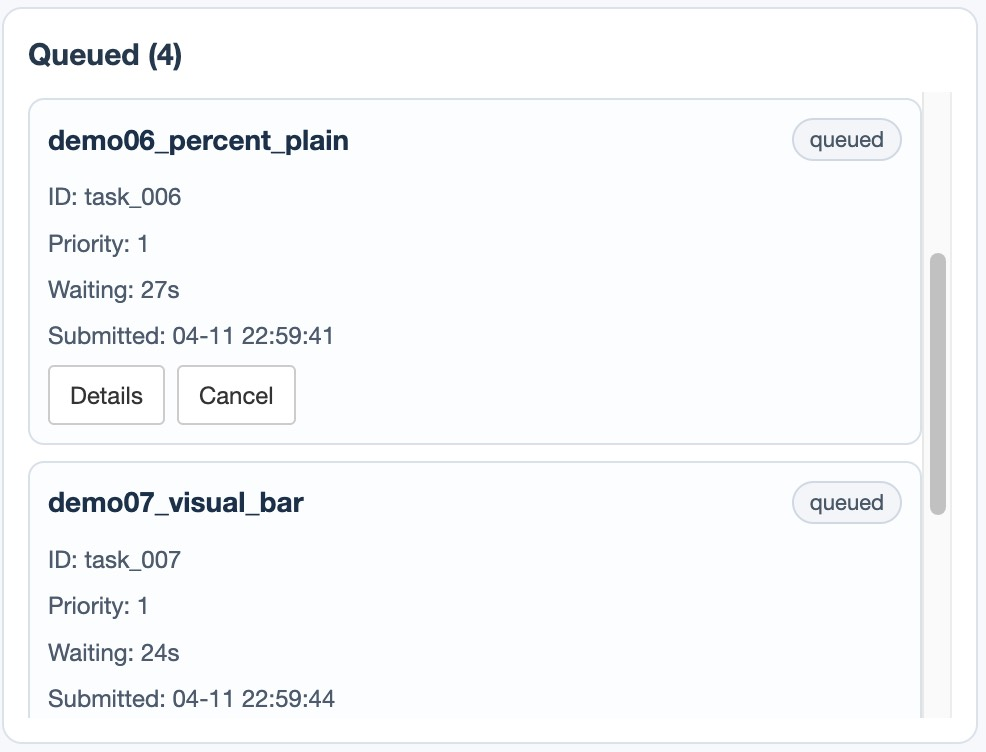

# Overview

`taskr` is a background task queue for R with a built-in Shiny dashboard.
It runs long jobs in separate R processes and keeps the main session usable.

Motivation: [`job`](https://github.com/lindeloev/job) introduced a useful
background-execution idea, but it depends on `rstudioapi`, which limits use in
new IDEs such as Positron. It also does not provide a full task-management
queue for scheduling, state tracking, and operational control.

`taskr` addresses these gaps with:

- queue-based scheduling for background tasks
- non-blocking task monitoring during long runs
- a built-in dashboard for live queue visibility
- simple controls for task management and result access

The queue is session-local and temporary by design: restarting R clears queue
state and task records.

# Installation

Install from GitHub:

```r
install.packages("remotes")
remotes::install_github("chenyu-psy/taskr")
```

# Quick Start

The fastest way to understand `taskr` is to run one complete workflow:
initialize queue capacity, submit work, monitor progress, retrieve outputs, and
clean up.

## Step 1: Initialize the Queue

`max_slots` is the total concurrency budget for the session.  
Higher values run more tasks at once, but also increase CPU and memory load.

```r
library(taskr)
init_queue(max_slots = 3)
```

## Step 2: Submit Work

Use `submit_code()` for quick inline code blocks.  
Use `submit_task()` when you already have a function plus explicit arguments.

```r
submit_code(
  expr = {
    Sys.sleep(10)
    "completed"
  },
  label = "demo_code"
)

submit_task(
  fun = function(n) {
    Sys.sleep(6)
    mean(rnorm(n))
  },
  args = list(n = 10000),
  label = "demo_function",
  resources = list(slots = 2L)
)
```

`resources$slots` is checked against `max_slots`.  
With `max_slots = 3`, a task requesting `slots = 2` can run, and leaves one
remaining slot for other queued work.

## Step 3: Monitor Task State

After Step 2 submits tasks, `taskr` auto-launches the dashboard in interactive
sessions. You can use it to watch queue progress and manage tasks (for example,
cancel tasks or clean finished records). See [Dashboard Panels](#dashboard-panels)
for panel-by-panel details.

If you prefer code-based monitoring, use:

```r
get_task_overview()
get_task_overview(status = "running")
```

## Step 4: Read Outputs

Use logs for runtime diagnostics and results for final outputs.

```r
get_task_log("demo_code")
get_task_result("demo_function")
```

# Dashboard Panels

In most interactive sessions, the dashboard appears automatically after you
submit tasks, so you can monitor progress right away. You can also call
`launch_dashboard()` manually if needed.

The dashboard opens in the IDE Viewer pane when available. If it does not
appear, check whether the Viewer pane is hidden, or copy the dashboard URL
printed in the console into a web browser.

## Overview

The dashboard gives a single view of the current queue. It separates running,
waiting, and finished tasks so you can quickly see what is happening without
polling the console.


## Summary Panel

The summary area reports overall queue state. Slot usage shows how much of the
configured capacity is currently occupied, and completion progress shows how
many submitted tasks have reached a terminal state. The search box filters task
cards by id or label across the dashboard.


## Running Panel

The running panel lists tasks that are currently executing. Each card reports
elapsed time, current status, and the latest progress signal when available.
Task details expand inline, and running tasks can be cancelled from the card.


## Queued Panel

The queued panel lists tasks that are waiting for available slots. Tasks are
ordered by priority and submit time, which makes it easier to understand why a
task has not started yet.



## Finished Panel

The finished panel keeps completed, failed, and cancelled tasks together. Status
filters help focus on failures or cancellations, and cleanup actions remove
finished records once they are no longer needed.


# Status

`taskr` is under active development. Feedback and contributions are welcome.
Before the first stable release, function names and parameters may change.
