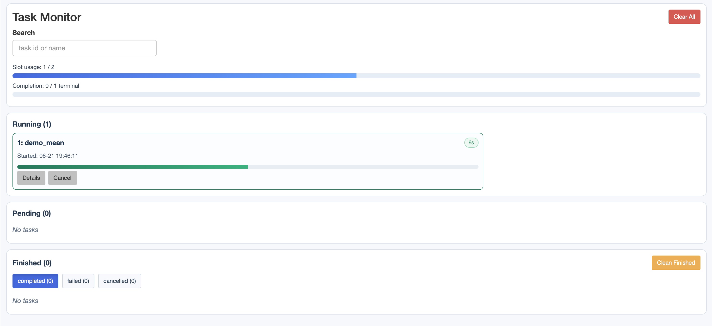
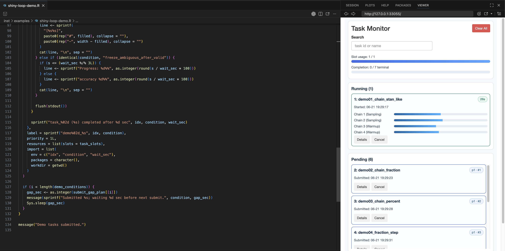
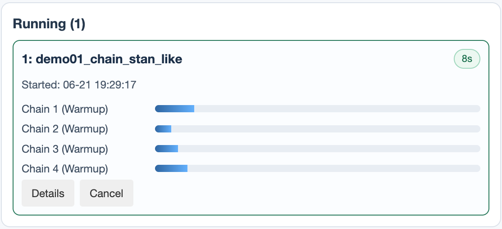
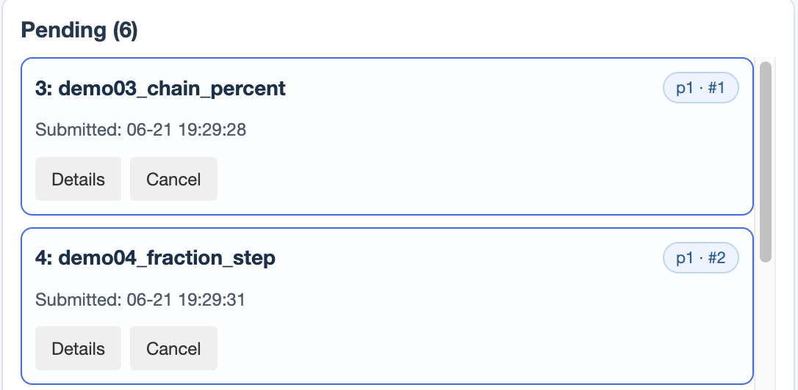
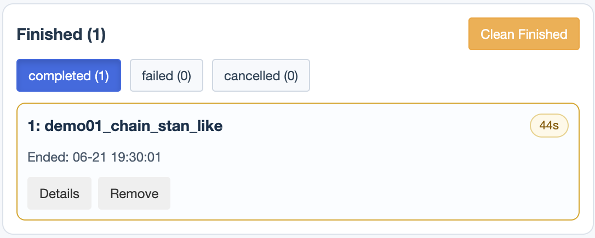

# taskr

[](https://github.com/chenyu-psy/taskr/actions/workflows/r-cmd-check.yml)

`taskr` runs long R computations in background R processes and gives you a
session-local queue for monitoring and managing them from a Shiny dashboard.

Use it when model fits, simulations, batch jobs, or other slow work would
otherwise lock up your interactive R console. Submit the work, keep using the
main session, and watch the queue from the dashboard.

The queue is intentionally temporary. Restarting R clears queue state, task
records, and stored task results.

## Installation

Install the development version from GitHub:

```r
install.packages("remotes")
remotes::install_github("chenyu-psy/taskr")
```

## Quick Start

Start a queue, submit a task, and use the dashboard to watch it run.

```r
library(taskr)

init_queue(max_slots = 2)

submit_task(
  fun = function(n) {
    Sys.sleep(5)
    mean(rnorm(n))
  },
  args = list(n = 10000),
  label = "demo_mean",
  output = "all"
)
```

After submission, the dashboard shows the task moving through the queue:



In interactive sessions, `taskr` opens the dashboard automatically after you
submit work. The dashboard is the recommended way to check whether tasks are
`pending`, `running`, `completed`, `failed`, or `cancelled`; inspect logs; cancel
or remove tasks; and clean finished records.

If you saved a return value with `output = "all"`, use the numeric task id from
the dashboard or from `get_task_overview()` to read it back:

```r
tasks <- get_task_overview(label = "demo_mean")
get_task_result(tasks$id[1])
```

When you are done with the whole queue, call:

```r
shutdown_queue()
```

## Submit Work

Most workflows start with `init_queue(max_slots = ...)`, where `max_slots` is
the session-level concurrency budget. A task can request one or more slots, and
the queue starts pending work as capacity becomes available.

Choose the submission helper that matches how your work is written:

| Situation | Use |
| --- | --- |
| You want to run a short inline expression | `submit_code()` |
| You already have a function and arguments | `submit_task()` |
| You want to submit many calls from a grid | `map_tasks()` |

Useful submission options:

- `label` gives a task a readable dashboard name. Labels are display and search
  metadata; task control uses numeric ids.
- `priority` lets more important pending tasks run earlier.
- `resources = list(slots = 2L)` reserves more of the queue capacity for a task.
- `import` controls which objects, packages, environment variables, and working
  directory are available in the child process.
- `output = "none"` is the default and avoids copying large return values into
  taskr storage. Use `output = "all"` when you want `get_task_result()` to return
  the task value later.

For quick inline work, use `submit_code()`:

```r
submit_code(
  expr = {
    Sys.sleep(3)
    "done"
  },
  label = "demo_code",
  output = "all"
)
```

Use `map_tasks()` when you have many related function calls from a parameter
grid; see `?map_tasks` for details.

## Monitor With the Dashboard

The dashboard is the main interface for routine monitoring and control. It
opens in the IDE Viewer pane when available; if it does not appear, copy the
dashboard URL printed in the console into a browser. You can also reopen it with
`launch_dashboard()`.



From the dashboard, you can:

- see slot usage and terminal-task progress;
- search tasks by id or label;
- inspect pending, running, completed, failed, and cancelled tasks;
- open task details and logs;
- cancel active work, remove individual task cards, or clean finished records.

These dashboard controls correspond to the same task-control API available from
R code, such as `cancel_task()`, `remove_task()`, and `clean_tasks()`.

### Running

The running panel shows tasks that are actively using queue slots. Each card
shows the task id and label, an elapsed-time badge, and any progress rows the
task reports. Open details to inspect logs while the task is still running, or
cancel the task from the card when it should stop early.

<p align="center">
  
</p>

### Pending

The pending panel shows submitted tasks that are waiting for enough free slots.
Badges summarize priority and queue position, and each card keeps the submitted
time visible so you can see why a task has not started yet. Pending tasks can be
cancelled before they start.

<p align="center">
  
</p>

### Finished

The finished panel keeps completed, failed, and cancelled records together.
Status filters help you focus on failures or cancellations, the duration badge
shows how long a terminal task took, and details remain available for review.
Remove individual records from their cards, or clean finished records when the
dashboard no longer needs to show them.

<p align="center">
  
</p>

## Use R Code When Needed

The dashboard covers most interactive monitoring. Use the R helpers when you
are scripting, testing, or integrating taskr into another workflow:

| Goal | Functions to read |
| --- | --- |
| Start or reset a queue | `init_queue()`, `shutdown_queue()` |
| Submit work | `submit_code()`, `submit_task()`, `map_tasks()` |
| Open the visual monitor | `launch_dashboard()` |
| Inspect state or outputs from R | `get_task_overview()`, `get_task_log()`, `get_task_result()`, `report_progress()` |
| Script task control or cleanup | `cancel_task()`, `remove_task()`, `clean_tasks()` |

Run `?function_name` in R for argument details and edge cases.

## Status

`taskr` is pre-stable and under active development. Function names, arguments,
and dashboard behavior may still change before `1.0.0`.
